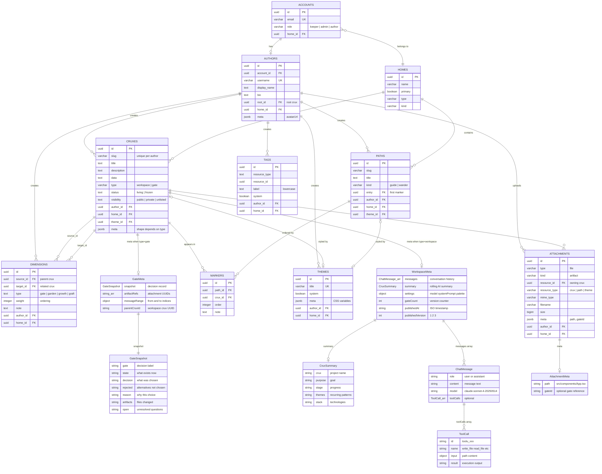

# Crux Garden App — Architecture Guide

This document traces the app from its entry point through every architectural layer and subsystem. It's meant to be read top-to-bottom as a walkthrough.

---

## 1. Entry Point

Everything starts from three files:

### `index.html`

The root HTML document. Contains `<div id="root">` (React's mount point) and `<script type="module" src="/src/main.tsx">` (the app entry). Sets the initial `<html class="dark">` so the dark theme applies before any JavaScript runs. Vite processes this file in both dev and production — see "Build Tool (Vite)" below.

### `src/main.tsx`

The React bootstrap. Does four things:

1. **Renders `<Bootstrap />`** inside `<StrictMode>` — the Bootstrap component calls `authStore.init()` on mount to check for stored JWT tokens and restore a session.
2. **Suppresses Monaco editor errors** — Monaco doesn't handle Strict Mode's double-invoke of effects. A custom `onCaughtError` handler on `createRoot` silences `InstantiationService has been disposed` errors. A global `window.error` listener catches the async disposal errors that escape React's boundary.
3. **Registers the preview service worker** — `preview-sw.js` intercepts `/__preview/{cruxId}/...` URLs and serves cached artifact files from the Cache API. This is how HTML preview works in the editor.
4. **Imports `globals.css`** — all CSS custom properties, font faces, Tailwind, and highlight.js styles.

### `src/App.tsx`

Creates the router and renders it. Two key things happen here:

- `<AnimatedBackground />` renders behind everything (bloom gradient, starfield, or flow field — controlled by a CSS custom property `--background-type`).
- `<RouterProvider router={router} />` drives all navigation.

---

## 2. Build Tool (Vite)

Vite is the build tool and dev server. It replaces older tools like Webpack or Create React App.

### Development (`npm run dev`)

Vite serves source files directly to the browser using native ES module `import` statements. When the browser requests `main.tsx`, Vite transforms it on the fly (TypeScript to JavaScript, JSX to React calls, CSS processing) and sends it back. It does **not** bundle everything into one file during development — it transforms individual files on demand. This is why it starts up almost instantly.

When you edit a file, Vite uses **Hot Module Replacement (HMR)** — it pushes only the changed module to the browser over a WebSocket, so you see updates without a full page reload.

### Production (`npm run build`)

For production, Vite uses **Rollup** under the hood to bundle everything into optimized static files: `dist/index.html`, `dist/assets/index-*.js`, `dist/assets/index-*.css`. These are the files nginx serves in Docker.

### `vite.config.ts` — Build configuration

```typescript
plugins: [react(), tailwindcss()],       // React JSX transform + Tailwind CSS processing
resolve: {
  alias: { '@': './src' },               // @/stores/cruxStore → src/stores/cruxStore
},
server: { port: 8080 },                 // Dev server port
build: { outDir: 'dist', sourcemap: true },
```

This is where you'd add proxy rules (e.g. forwarding `/api` to the NestJS server), additional Vite plugins, or custom Rollup options.

### `vite-env.d.ts` — TypeScript type declarations for Vite

This file teaches TypeScript about Vite-specific features:

1. **`/// <reference types="vite/client" />`** — imports Vite's built-in type definitions. Makes `import.meta.env` work, and tells TypeScript how to handle non-JS imports like `import './styles/globals.css'` or `import logo from './logo.svg'` (which would otherwise be type errors).

2. **`ImportMetaEnv` interface** — declares that `import.meta.env.VITE_API_URL` exists and is a string. This is used in `src/api/client.ts`:

   ```typescript
   const API_BASE_URL = import.meta.env.VITE_API_URL || 'http://localhost:3000';
   ```

Vite only exposes env variables prefixed with `VITE_` to the browser (security measure — prevents server secrets like `DATABASE_URL` from ending up in client JavaScript).

---

## 3. Key Technology Choices

Beyond Vite and Zustand (covered in their own sections), the app relies on several libraries that are worth understanding before reading the code.

### HTTP — Axios + native fetch

Two HTTP strategies coexist:

- **Axios** (`axios` 1.7) — used for all REST API calls: CRUD, auth, file uploads. Configured in `src/api/client.ts` with JWT interceptors that auto-attach the access token to every request and auto-refresh on 401 responses.
- **Native `fetch`** — used *only* for AI chat streaming in `src/api/ai.ts`. Axios doesn't support Server-Sent Events (SSE), so the chat system uses `fetch` with a `ReadableStream` to process the AI's token-by-token response. The stream is decoded with `TextDecoder` and parsed line-by-line for `data:` events.

### Styling — Tailwind CSS 4

Utility-first CSS framework. Instead of writing `.my-button { background: green; padding: 8px; }`, you write `className="bg-accent p-2"` directly on elements. Tailwind scans your source files for class names and generates only the CSS you actually use.

**Tailwind 4** is the latest version — it uses CSS-native `@theme` blocks in `globals.css` instead of the `tailwind.config.js` file that older versions required. The app's theme is driven by ~60 CSS custom properties (`--bg`, `--text`, `--accent`, etc.) that swap between dark and light mode via a class on `<html>`.

Two helper utilities keep class names manageable:

- **`clsx`** — conditionally joins class names: `clsx('base', isActive && 'text-accent')`
- **`tailwind-merge`** — deduplicates conflicting Tailwind classes (e.g., `p-2 p-4` → `p-4`)

These are combined into a single `cn()` function in `src/lib/cn.ts`:

```typescript
import { clsx, type ClassValue } from 'clsx';
import { twMerge } from 'tailwind-merge';
export const cn = (...inputs: ClassValue[]) => twMerge(clsx(inputs));
```

### Code Editor — Monaco Editor

The same editor engine that powers VS Code, loaded via `@monaco-editor/react`. Used in the "Workshop" pane for editing artifact files. The wrapper handles loading the editor asynchronously (Monaco is a large bundle — it loads on demand rather than being included in the initial page load). Supports syntax highlighting, multi-tab editing, and all the keyboard shortcuts you'd expect from VS Code.

Note: Monaco doesn't play well with React's Strict Mode (which double-invokes effects in development). The app handles this with error suppression in `main.tsx` — see section 1.

### File Tree — react-arborist

A virtualized tree component used in the "Artifacts" pane. Key features:

- **Drag-and-drop** — reorder files and move them between folders
- **Inline rename** — click a file name to edit it in place
- **Virtualized rendering** — only renders the visible rows, which matters when a crux has many files

### Pane Layout — react-resizable-panels

The workspace has 8 resizable panes (Collaboration, Artifacts, Workshop, Details, History, Export, Sync, Publish). This library provides the drag handles between panes and manages their sizes. Panes can be toggled on/off from the TopBar, and their layout is persisted to localStorage per crux.

### Markdown Rendering

A three-library stack used in chat messages, published content, and the display mode:

- **react-markdown** — renders markdown as React components (safe by design — no `dangerouslySetInnerHTML`)
- **remark-gfm** — plugin that adds GitHub Flavored Markdown: tables, strikethrough, task lists, autolinks
- **rehype-highlight** — plugin that syntax-highlights fenced code blocks using highlight.js. The theme colors are overridden in `globals.css` to match the app's palette.

### Image Viewer — react-photo-view

Lightbox-style image viewer for published cruxes and artifact previews. Click an image and it opens in a zoomable, pannable overlay with navigation arrows.

### File Export — JSZip

Generates `.zip` files entirely client-side for downloading all artifacts from a crux at once. No server round-trip needed — the zip is built from cached file contents in the browser.

### Service Worker (custom — `preview-sw.js`)

Not a package — a hand-written service worker in `public/preview-sw.js`. It intercepts `/__preview/{cruxId}/...` URLs and serves cached artifact files from the browser's Cache API. This is how the HTML preview iframe loads multi-file sites (HTML referencing CSS, JS, and images) without hitting the server for each asset. Registered on app startup in `main.tsx`.

---

## 4. Routing

The app uses React Router v7 with `createBrowserRouter`. Routes split into three groups:

### Public routes (no auth required)

| Path | Page | Purpose |
|------|------|---------|
| `/` | `Landing` | Marketing homepage |
| `/login` | `Login` | Email + code auth flow |
| `/:username/:slug` | `PublicCrux` | Published crux display mode |
| `/:username` | `PublicAuthor` | Author's public profile/gallery |

### Protected routes (behind `AuthGuard`)

| Path | Page | Purpose |
|------|------|---------|
| `/home` | `Garden` | User's crux library |
| `/c/:id` | `Crux` | The workspace (where everything happens) |
| `/settings` | `Settings` | Profile, API key, preferences |

### Route protection: `AuthGuard`

`AuthGuard` (`src/components/auth/AuthGuard.tsx`) is a layout route wrapper. It reads `authStore.isAuthenticated` and `authStore.isLoading`:

- While loading: renders a centered spinner
- If not authenticated: redirects to `/login`
- If authenticated: renders `<Outlet />` (the child route)

### Layout wrapper: `AppShell`

Protected routes are nested inside `AppShell` (`src/components/layout/AppShell.tsx`), which provides:

- **TopBar** — persistent header with breadcrumb navigation, pane toggle buttons, and user menu
- **`<Outlet />`** — the active page fills the remaining vertical space
- **CommandPalette** — `Cmd+K` opens a fuzzy search for cruxes and settings
- **KeeperConsole** — `Escape` opens an AI assistant sidebar

The nesting is: `AuthGuard` > `AppShell` > Page.

---

## 5. State Management (Zustand)

### What Zustand Is

Zustand is the state management library. It solves a fundamental React problem: how do you share data between components that aren't parent/child?

React components pass data down through props. But when a deeply nested component (like `MessageInput` inside `ChatPane` inside `WorkspaceLayout`) needs the current crux, and a completely separate component (like `TopBar`) also needs the crux title, threading props through every intermediate component gets painful ("prop drilling").

Zustand creates **stores** — standalone JavaScript objects that hold state and actions. Any component anywhere in the tree can subscribe to a store and read/write its data directly, without props:

```typescript
// Define the store (src/stores/cruxStore.ts)
export const useCruxStore = create((set, get) => ({
  crux: null,                           // state
  messages: [],                         // state
  addMessage: (msg) => {                // action — updates state via set()
    set((state) => ({ messages: [...state.messages, msg] }));
  },
}));

// Use in any component — no provider, no context, no props
function TopBar() {
  const title = useCruxStore((s) => s.crux?.title);  // selector
  return <span>{title}</span>;
}
```

Key properties:

- **Selectors** — `useCruxStore((s) => s.crux?.title)` only re-renders when that specific value changes, not when `messages` or `artifacts` update. React's built-in `useContext` re-renders every consumer when any value changes.
- **No Provider** — Redux and Context require wrapping the app in a `<Provider>`. Zustand stores are just imports.
- **Plain functions** — no action types, no reducers, no dispatch. `set()` updates state directly.
- **Works outside React** — `useCruxStore.getState()` works in plain functions, not just components. Used in `deleteArtifact` where cruxStore dynamically imports uiStore to close editor tabs.

### The Five Stores

All app state lives in five stores. Components subscribe to individual slices via selectors so only the subscribed values trigger re-renders.

| Store | What it owns | Used by |
| ----- | ----------- | ------- |
| `authStore` | Who you are (account, tokens, author) | AuthGuard, LoginForm, TopBar, Settings |
| `cruxStore` | What you're working on (crux, messages, artifacts, gates) | Crux page, chat, file tree, publish |
| `uiStore` | How the workspace looks (pane layout, editor tabs, folders) | WorkspaceLayout, TopBar, EditorPane |
| `gardenStore` | Your library (crux list, search, sort) | Garden page |
| `themeStore` | Visual mode (dark/light) | Settings, globals.css |

Components typically subscribe to multiple stores. For example, `WorkspaceLayout` reads from `uiStore`, `cruxStore`, and `authStore`.

### `authStore` — Identity

**File:** `src/stores/authStore.ts` (125 lines)

Manages who you are. State:

- `account: Profile | null` — email, role, homeId
- `author: Author | null` — username, displayName, bio, avatar
- `isAuthenticated: boolean`
- `isLoading: boolean` — true during init (checking stored tokens)

Key actions:

| Action | What it does |
|--------|-------------|
| `init()` | On app mount — checks localStorage for tokens, calls `GET /auth/profile`. If the access token is expired, tries refresh. If that fails, clears tokens. |
| `requestCode(email)` | `POST /auth/code` — server sends a login code via email |
| `login(email, code)` | `POST /auth/login` — exchanges code for JWT tokens, fetches profile |
| `logout()` | `POST /auth/logout` + clears localStorage tokens |
| `updateAuthor(dto)` | Updates username/displayName/bio via API |
| `uploadAvatar(file)` / `removeAvatar()` | Avatar management via API |

Token storage uses three localStorage keys: `cruxgarden:accessToken`, `cruxgarden:refreshToken`.

### `cruxStore` — Active Workspace

**File:** `src/stores/cruxStore.ts` (435 lines)

The largest and most important store. Manages the currently-open crux and everything in it.

**State:**

```
crux: Crux | null              // The active crux entity
messages: ChatMessage[]         // Full conversation history
artifacts: Attachment[]         // All files in this crux
summary: CruxSummary | null    // AI-generated project summary

isStreaming: boolean            // Currently receiving SSE
streamingContent: string        // Partial text being streamed

hasUnpublishedChanges: boolean  // Something changed since last publish
artifactsVersion: number        // Increments on any artifact change

gates: Dimension[]              // Version history entries
gateCount: number               // Total gate count
isCreatingGate: boolean         // Gate generation in progress
pendingGateCreation: boolean    // Signal to create a gate after streaming ends

pendingDeletes: {attachmentId, path}[]  // Files the AI requested to delete (awaiting confirmation)
```

**Action groups:**

- **Crux lifecycle:** `loadCrux(id)`, `createCrux(title?)`, `updateCrux(dto)`, `reset()`
- **Chat:** `addMessage()`, `setStreaming()`, `appendStreamContent()`, `clearStreamContent()`
- **Artifacts:** `setArtifacts()`, `addArtifact()`, `updateArtifact()`
- **File CRUD:** `createFile(path)`, `uploadFile(file)`, `moveArtifact()`, `renameArtifact()`, `deleteArtifact()`, `saveArtifactContent()`
- **Publishing:** `publishCrux()`, `unpublishCrux()`
- **Gates:** `loadGates()`, `addGate()`, `setSummary()`, `setPendingGateCreation()`
- **Delete confirmation:** `addPendingDelete()`, `confirmDelete()`, `dismissDelete()`
- **Settings:** `setModel()`, `setPalette()`, `saveMeta()`

`loadCrux(id)` fetches the crux and its attachments, detects if changes exist after the last publish (compares timestamps), and populates the store.

`createCrux()` generates a slug from the title + base-36 timestamp, sets a system prompt ("You are The Keeper..."), and creates via API.

`saveMeta()` persists the current messages, summary, and gateCount back to the crux's `meta` field via `PATCH /cruxes/:id`.

`deleteArtifact(id)` also dynamically imports uiStore to close any editor tab for the deleted file.

### `uiStore` — Layout & Editor State

**File:** `src/stores/uiStore.ts` (606 lines)

The most complex store. Controls how the workspace looks: which panes are visible, their order, editor tabs, folder state, context menus, and mobile mode.

**Pane system:**

There are 8 pane types: `history`, `collaboration`, `artifacts`, `workshop`, `details`, `sync`, `publish`, `export`.

- `paneOrder: PaneType[]` — determines left-to-right arrangement
- `paneVisibility: Record<PaneType, boolean>` — which are shown
- Default: only `collaboration` is visible on first load

**Editor state:**

```
editor: {
  tabs: EditorTab[]      // {id, path, name, dirty, viewMode, scrollTop}
  activeTabId: string     // Which tab is focused
  diffTargetId: string    // For diff view comparison
}
```

**Persistence (localStorage):**

Layout is persisted at two levels:

- **Global:** `cruxgarden:layout:global` — default pane arrangement
- **Per-crux:** `cruxgarden:layout:{cruxId}` — crux-specific layout overrides
- **Editor tabs:** `cruxgarden:editor-tabs:{cruxId}` — which files are open
- **Folder state:** `cruxgarden:folder-state:{cruxId}` — which tree folders are expanded

Resolution order: per-crux layout > global layout > defaults.

The store includes **migration logic** for old pane names (`navigation` -> `history`, `chat` -> `collaboration`, `editor` -> `workshop`, `metadata` -> `details`).

**`setActiveCrux(id)`** is the pivot action — called when entering/leaving a crux workspace. It saves the current state, loads the target crux's persisted layout, editor tabs, and folder state.

**Scroll position** uses a debounced save (500ms) to avoid thrashing localStorage.

**Legacy compatibility** — computed getters (`fileViewerOpen`, `timelineOpen`) map the old property names to the current pane system.

### `gardenStore` — Crux Library

**File:** `src/stores/gardenStore.ts` (79 lines)

Manages the list of all your cruxes for the Garden page.

- `cruxList`, `loading`, `search`, `sortBy`, `pagination`
- `load()` fetches from `GET /cruxes`, then filters and sorts client-side (the API doesn't support search yet)
- Search is substring matching on title, slug, description
- Sort is newest-first by `created` or `updated`

### `themeStore` — Visual Mode

**File:** `src/stores/themeStore.ts` (44 lines)

Simple dark/light/auto toggle.

- Reads initial mode from `localStorage: cruxgarden:theme` (defaults to `dark`)
- Resolves `auto` via `window.matchMedia('(prefers-color-scheme: light)')`
- Applies by toggling `dark`/`light` class on `<html>` element
- CSS custom properties in `globals.css` change based on this class

### Store vs Hook — Why Two Layers?

Stores and hooks have distinct responsibilities:

**Stores = the data and operations.** A store is a plain JavaScript object that exists outside of React. It holds state and functions to change it. `cruxStore` holds the current crux, messages, artifacts, and gates, plus operations like `loadCrux()`, `addMessage()`, `deleteArtifact()`. When you call `set()`, Zustand notifies subscribed components to re-render. Stores don't know about React's component lifecycle — they can't react to mounting, unmounting, or dependency changes.

**Hooks = the wiring between data, side effects, and component lifecycle.** Hooks answer "when should something happen?" They bridge React's lifecycle to the stores. `useChat` doesn't hold messages (that's `cruxStore`). It orchestrates: when the user sends a message, start an SSE stream and feed events into the store. When the component unmounts, abort the stream. When streaming ends, finalize the message and flag pending gate creation.

**Why not put everything in the store?**

1. **No cleanup on unmount** — stores don't know when a component disappears. If you navigate away mid-stream, who aborts the fetch? Hooks have `useEffect` cleanup for this.
2. **No reactive dependencies** — stores can't say "when X and Y both change, do Z." Hooks can, via `useEffect` deps.
3. **Stores become god objects** — `cruxStore` would need to know about SSE parsing, gate creation, AI streaming, and preview caching. Instead, each hook owns one async coordination concern.

**The data flow:**

```text
Component (renders UI)
    ↓ reads from
Store (holds state, exposes actions)
    ↑ writes to
Hook (coordinates when actions happen, manages side effects)
    ↑ reacts to
Store (reads state to decide what to do next)
```

**Concrete example — sending a chat message:**

1. `ChatPane` calls `useChat().send("make me a website")`
2. `useChat` adds the user message to `cruxStore`
3. `useChat` starts an SSE stream (fetch with AbortController)
4. On each SSE event → `useChat` updates `cruxStore` (streaming content, tool calls)
5. On stream end → `useChat` finalizes the message in `cruxStore`, sets `pendingGateCreation`
6. On unmount → `useChat` aborts the fetch (cleanup)
7. `useGates` (separate hook, same component) watches `cruxStore.pendingGateCreation`
8. When it flips true AND streaming stops → `useGates` runs `createGate()`
9. `createGate()` writes the snapshot back to `cruxStore`

**Store** = *what* the data is. **Hook** = *when* and *how* things happen in response to that data changing. The split keeps each piece small: stores are just state + simple mutations, hooks are just coordination logic, components are just rendering. No single layer does too much.

---

## 6. API Layer

All server communication goes through `src/api/`. The barrel export is `src/api/index.ts`.

### HTTP Client (`src/api/client.ts`)

An Axios instance configured with:

- **Base URL:** `VITE_API_URL` env var, defaults to `http://localhost:3000`
- **Request interceptor:** attaches `Authorization: Bearer {accessToken}` from localStorage
- **Response interceptor:** on 401, attempts token refresh via `POST /auth/token`. Concurrent 401s are deduped — only one refresh request fires. On refresh failure, tokens are cleared (user is logged out).

### API Modules

| Module | Endpoints | Purpose |
|--------|-----------|---------|
| `auth.ts` | `POST /auth/code`, `POST /auth/login`, `POST /auth/token`, `GET /auth/profile`, `DELETE /auth/logout` | Authentication |
| `cruxes.ts` | CRUD on `/cruxes`, dimensions, attachments, publishing, tags | Core data |
| `authors.ts` | `GET/PUT /authors/:id`, avatar upload/remove | Author profile |
| `ai.ts` | `POST /ai/chat` (SSE) | AI streaming |
| `public.ts` | `GET /public/authors/:username/cruxes/:slug` + attachments | Unauthenticated public view |
| `paths.ts` | CRUD on `/paths`, markers | Path management (future) |

### SSE Streaming (`src/api/ai.ts`)

The AI module does NOT use Axios. It uses the native `fetch` API because Axios doesn't support streaming responses.

`streamChat(cruxId, messages, onEvent, model?, signal?)`:

1. Sends `POST /ai/chat` with JWT auth header + optional `X-Anthropic-Key` header (user's own API key)
2. Reads the response body as a stream via `ReadableStream.getReader()`
3. Parses SSE events from the text stream (lines starting with `event:` and `data:`)
4. Calls `onEvent()` for each parsed event

SSE event types:

| Event | Data | Meaning |
|-------|------|---------|
| `text` | `{content}` | Text delta from the AI |
| `tool_start` | `{id, name, input}` | AI is calling a tool |
| `tool_result` | `{id, name, result}` | Tool execution completed |
| `delete_request` | `{attachmentId, path}` | AI wants to delete a file (needs confirmation) |
| `error` | `{message}` | Error during generation |
| `done` | `{}` | Stream finished |

### Type Definitions (`src/api/types.ts`)

290 lines of TypeScript interfaces covering every entity:

- **Auth:** `AuthCredentials`, `Profile`
- **Core:** `Author`, `Crux`, `Attachment`, `Dimension`, `Tag`, `Theme`, `Path`, `Marker`
- **Chat:** `ChatMessage` (role, content, toolCalls), `ToolCall` (name, input, result)
- **Meta:** `CruxMeta` (messages, summary, settings, snapshot, artifactRefs, messageRange)
- **DTOs:** `CreateCruxDto`, `UpdateCruxDto`, `CreateAuthorDto`, etc.

---

## 7. The Chat System

The chat system is how users interact with the AI. It spans the API layer, a hook, and the store.

### `useChat` Hook (`src/hooks/useChat.ts`)

The central orchestrator. It bridges the cruxStore (state) and the SSE stream (server).

**`send(content)`** — the main action:

1. Creates a `ChatMessage` with role `user` and adds it to the store
2. Calls `buildApiMessages()` to convert the full message history into Anthropic API format
3. Opens an SSE stream via `streamChat()`
4. Processes events as they arrive:
   - `text` — appends to `streamingContent` for live rendering
   - `tool_start` — pushes to a local `toolCalls[]` array
   - `tool_result` — updates the tool call's result, refreshes artifacts from the server
   - `delete_request` — adds to `pendingDeletes` in cruxStore
   - `error` — appends error text
5. After the stream ends, adds the assistant message to the store (with tool calls attached)
6. Saves meta to the server
7. If any file-mutation tool was called (`write_file`, `edit_file`, `delete_file`), sets `pendingGateCreation: true`

**`buildApiMessages()`** — critical for multi-turn tool use:

Anthropic's API requires alternating user/assistant roles with proper `tool_use`/`tool_result` blocks. This function:

- Converts assistant messages with `toolCalls` into content block arrays with `type: "tool_use"` entries
- Creates corresponding `tool_result` blocks and merges them with the next user message (to maintain alternating roles)
- Truncates large tool results to 1200 chars

**`stop()`** — aborts the current stream via `AbortController`.

### Message Rendering

Messages flow from the store through:

- `ChatPane` → `ChatPanel` → `MessageList` → `MessageBubble`
- `MessageBubble` renders markdown via `MarkdownRenderer` (react-markdown + remark-gfm + rehype-highlight)
- Tool calls are rendered as collapsible chips showing the tool name and input/result
- During streaming, `streamingContent` is rendered with a typing animation

---

## 8. The Gate System (Version History)

Gates are automatic version snapshots created after the AI modifies files.

### `useGates` Hook (`src/hooks/useGates.ts`)

A reactive hook that watches for `pendingGateCreation` and triggers gate creation when streaming ends.

**Gate creation flow (5 steps):**

1. **Generate snapshot** — sends the recent conversation excerpt to the AI with a structured prompt. The AI returns a snapshot with fields: GATE, STATE, DECISION, REJECTED, REASON, ARTIFACTS, OPEN.
2. **Create gate crux** — creates a new Crux of type `gate` with the snapshot in its meta, linked to the parent crux via `parentCruxId`.
3. **Link via dimension** — creates a `gate` dimension from the parent crux to the gate crux with `weight` = gate number (for ordering).
4. **Generate summary** — sends the snapshot to the AI to update the running project summary (CRUX, PURPOSE, STAGE, THEMES, STACK).
5. **Save meta** — updates the parent crux's meta with the new summary and gate count.

**Reconciliation:** Every 10 gates, the summary is regenerated from scratch using the entire gate chain.

Gate snapshots use the same SSE streaming endpoint as chat (`POST /ai/chat`) via a helper `collectStreamText()` that accumulates text events.

### Gate UI

- `NavigationPane` → `GateTimeline` → `GateCard` renders the vertical timeline
- `CruxSummary` renders the rolling summary above the timeline
- Each gate card shows its title (from `snapshot.gate`), state, and timestamp

---

## 9. The Workspace (Pane System)

The crux workspace is an 8-pane resizable layout. This is the heart of the app.

### `Crux` Page (`src/pages/Crux.tsx`)

The page-level container. On mount:

1. Calls `loadCrux(id)` and `setActiveCrux(id)` (restores layout from localStorage)
2. Watches `artifacts.length` to auto-show the Artifacts and Workshop panes when the first artifact appears
3. Sets `document.title` to the crux title
4. Sets up unsaved-changes protection — `beforeunload` event + React Router's `useBlocker` with a Save/Discard/Stay modal
5. Renders `<WorkspaceLayout />`

### `WorkspaceLayout` (`src/components/workspace/WorkspaceLayout.tsx`)

The layout engine. Uses `react-resizable-panels` for the panel grid.

**How it works:**

1. Reads `paneOrder` and `paneVisibility` from uiStore
2. Filters to `visiblePanes` — only panes where visibility is true
3. Renders a horizontal `<Group>` of `<Panel>` components with `<ResizeHandle>` separators
4. Each panel wraps a `<DraggablePane>` (drop zone for drag-to-reorder) around the pane component
5. Pane components are looked up from `PANE_COMPONENTS` — a static map of `PaneType` to React component

**Pane configuration:**

| Pane | Min Size | Default Size | Component |
|------|----------|-------------|-----------|
| `history` | 10% | 18% | `NavigationPane` |
| `collaboration` | 20% | 40% | `ChatPane` |
| `artifacts` | 10% | 16% | `ArtifactsPane` |
| `workshop` | 15% | 26% | `EditorPane` |
| `details` | 10% | 16% | `MetadataPane` |
| `sync` | 10% | 16% | `SyncPane` |
| `publish` | 10% | 16% | `PublishPane` |
| `export` | 10% | 16% | `ExportPane` |

**Desktop vs mobile:**

- Desktop: multi-pane horizontal layout (shown at `md:` breakpoint and above)
- Mobile: single active pane with a `MobilePaneSwitcher` bottom bar

**Context menu:** A global `<ContextMenu>` handles right-click actions in the file tree (new file, new folder, rename, delete, open, copy URL).

### TopBar Pane Toggles

The TopBar shows one icon button per pane type. Enabled panes appear in `paneOrder` with their accent color; disabled panes appear dimmed after a divider. Clicking toggles visibility. Each pane has a distinct color read from CSS custom properties (`--pane-collaboration`, `--pane-artifacts`, etc.).

---

## 10. Artifacts & File Management

Artifacts are files attached to a crux — the things the AI creates.

### Data Model

Artifacts are `Attachment` entities on the server. Key fields:

```typescript
{
  id: string           // UUID
  filename: string     // Original filename
  mimeType: string     // e.g. "text/html"
  meta: {
    path?: string      // Virtual file path (e.g. "src/index.html")
  }
  size: number
  encoding: string
  created: string
  updated: string
}
```

The `meta.path` field stores the virtual directory structure. The actual file content is stored in S3 (or mocked locally).

### File CRUD in `cruxStore`

| Action | How it works |
|--------|-------------|
| `createFile(path)` | Creates an empty Blob, wraps in File, uploads via `POST /cruxes/:id/attachments` with path in meta |
| `uploadFile(file, parentPath?)` | Prepends parentPath to filename, uploads via FormData |
| `moveArtifact(id, newParentPath)` | Updates the `meta.path` via `PUT /attachments/:id` |
| `renameArtifact(id, newPath)` | Same mechanism, new path |
| `deleteArtifact(id)` | `DELETE /attachments/:id`, removes from local state, closes editor tab |
| `saveArtifactContent(id, content)` | Creates a new Blob from content, uploads as file replacement via `PUT /attachments/:id` |

### File Tree (`ArtifactsPane`)

The file tree uses `react-arborist` — a virtualized tree component with:

- Drag-and-drop (move files between folders)
- Inline rename (double-click or F2)
- Context menu (right-click)
- Folder expand/collapse state persisted per crux

Tree data is converted from the flat `artifacts[]` array into a nested tree structure by `treeData.ts`, using the `meta.path` of each attachment to derive parent/child relationships.

### Editor (`EditorPane` / `EditorContent`)

The Workshop pane hosts a Monaco Editor instance:

- Opens files via the `openFile(id, path)` action on uiStore
- Loads file content via `useFileContent` hook (downloads blob from API, converts to text or blob URL)
- Tracks dirty state — marks tab dirty on edit, clears on save
- Save: `Cmd+S` triggers `saveArtifactContent()`, which uploads the new content
- View modes: `source` (Monaco editor) or `preview` (HTML rendered in iframe)

### `useFileContent` Hook

Downloads attachment content via `cruxes.downloadAttachment()`. For text MIME types, reads the blob as text. For binary (images, etc.), creates an object URL. Returns `content` (string) or `blobUrl` (for images). Includes a `refetch()` method and `contentVersion` counter (used as a React key to force Monaco to remount with fresh content).

### HTML Preview System

For HTML files, the Workshop pane can toggle to "preview" mode:

1. `usePreviewUrl` hook downloads all artifacts for the crux
2. Writes them to the browser's **Cache API** at virtual paths like `/__preview/{cruxId}/style.css`
3. A **service worker** (`preview-sw.js`) intercepts fetch requests matching `/__preview/*` and serves from the cache
4. The preview iframe loads `/__preview/{cruxId}/index.html?v=N` — the service worker serves the cached HTML
5. When the HTML content changes (live editing), only the HTML entry is updated in the cache (no re-download of other assets)

This architecture means the preview iframe can load relative assets (`./style.css`, `./images/logo.png`) naturally — the service worker resolves them from the same cache.

URL rewriting (`src/lib/rewriteUrls.ts`) handles `src`, `href`, and CSS `url()` references — resolving relative paths against the file's directory.

---

## 11. Publishing & Display Mode

Publishing makes a crux visible at a public URL. The system has two sides: the **publish flow** (authenticated, from the workspace) and the **display mode** (unauthenticated, for visitors).

### Publish Flow

**Files:** `components/workspace/PublishPane.tsx` → `stores/cruxStore.ts` → `api/cruxes.ts`

The Publish pane handles an auth gate before publishing:

1. **Not logged in?** → saves the current path to `sessionStorage` and redirects to `/login`
2. **No author profile?** → opens `CreateAuthorModal` to create a username
3. **Ready** → calls `cruxStore.publishCrux()`

`publishCrux()` executes two sequential API calls:

1. `cruxes.update(id, { meta })` — saves the latest meta (messages, summary, settings)
2. `cruxes.publish(id)` → `POST /cruxes/{id}/publish`

The server sets `meta.publishedAt` (ISO timestamp), `meta.publishedVersion` (incrementing integer), and visibility to public. The crux is now accessible at `/@username/slug`.

After publishing, the pane shows:

- **Version info** — published version number and timestamp
- **Public URL** — with copy-to-clipboard and open-in-new-tab buttons
- **Unpublish button** — calls `cruxStore.unpublishCrux()` → `POST /cruxes/{id}/unpublish`

`hasUnpublishedChanges` tracks whether anything changed since the last publish. It's computed during `loadCrux()` by comparing the most recent attachment `updated` timestamp against `meta.publishedAt`.

### Public API Module (`api/public.ts`)

The public display mode uses a completely separate API client — plain `fetch()` with no Axios instance and no JWT interceptors. This means published cruxes can be viewed without any authentication.

Exported functions:

| Function | Endpoint | Purpose |
| --- | --- | --- |
| `getAuthor(username)` | `GET /authors/@{username}` | Author profile |
| `getAuthorCruxes(username)` | `GET /authors/@{username}/cruxes` | Paginated crux list |
| `getCruxBySlug(username, slug)` | `GET /authors/@{username}/cruxes/{slug}` | Single published crux |
| `getAttachments(username, slug)` | `GET /authors/@{username}/cruxes/{slug}/attachments` | All attachments |
| `downloadAttachment(username, slug, id)` | `GET .../attachments/{id}/download` | File blob |
| `getDownloadUrl(username, slug, id)` | *(URL builder, no fetch)* | Direct download URL |

All routes are under `/authors/@{username}` — the `@` prefix is added by an internal `authorPath()` helper.

### Public Display (`PublicCrux` page)

**Files:** `pages/PublicCrux.tsx` → `api/public.ts` → `components/display/ArtifactRenderer.tsx`

Unauthenticated route at `/:username/:slug`. React Router doesn't support `/@:param` (literal + dynamic in one segment), so the route is `/:username/:slug` and the component checks for the `@` prefix at runtime — URLs without it render as "not found".

Load sequence:

1. Extracts `username` (strips `@`) and `slug` from URL params
2. Fetches crux + attachments in parallel via `publicApi`
3. Sets `document.title` to the crux title
4. Renders `PublicTopBar` + `ArtifactRenderer` + optional metadata sidebar

The metadata sidebar (toggled from the top bar) shows `MetadataContent` in read-only mode — title, author, AI-generated summary, and the full conversation history ("how was this made?").

### Content Resolution (`ArtifactRenderer`)

**File:** `components/display/ArtifactRenderer.tsx`

`ArtifactRenderer` receives the attachment list and runs `resolveMain()` to pick the primary file and display mode. The priority chain:

| Priority | Rule | Mode |
| --- | --- | --- |
| 1 | `index.html` at root | `html` |
| 2 | Any root-level `.html` / `.htm` | `html` |
| 3 | Any `.html` / `.htm` anywhere | `html` |
| 4 | `README.md` at root | `markdown` |
| 5 | Any `.md` / `.mdx` | `markdown` |
| 6 | Exactly one image attachment | `image` |
| 7 | Fallback (or no attachments) | `listing` |

Each mode maps to a renderer component:

- **`HtmlRenderer`** — caches all attachments via the service worker, loads the entry HTML in a sandboxed iframe via `src=` (see "Preview Service Worker" below)
- **`MarkdownRendererView`** — downloads the markdown file via `publicApi.downloadAttachment()`, renders with `react-markdown`
- **`ImageRenderer`** — renders `` pointing to the public download URL
- **`FileListing`** — sorted file list with icons, sizes, and download links

### Preview Service Worker (Workspace & Public)

Both the workspace HTML preview and the public display mode use the same service worker architecture. The system has three layers:

**1. Service Worker (`public/preview-sw.js`)**

A hand-written service worker (not from a framework). Registered on app startup in `main.tsx`. Behavior:

- `install`: calls `skipWaiting()` to activate immediately
- `activate`: calls `clients.claim()` to take control of all open tabs
- `fetch`: only intercepts requests matching `/__preview/*` — all other requests (React Router, API, fonts, static assets) pass through untouched
- For intercepted requests: parses the cruxId from the URL, opens `Cache API` storage named `crux-preview-{cruxId}`, and serves the matching cached response. Returns 404 if not found.

**2. Cache Library (`lib/previewCache.ts`)**

Client-side Cache API wrapper. Key insight: the Cache API is shared between the main thread and the service worker — no `postMessage` needed.

| Function | Purpose |
| --- | --- |
| `cachePreviewFiles(cruxId, files)` | Clear + write all files for a crux |
| `updatePreviewFile(cruxId, file)` | Update a single file without clearing others |
| `clearPreviewCache(cruxId)` | Delete the entire cache for a crux |
| `getPreviewUrl(cruxId, path, version)` | Build `/__preview/{cruxId}/{path}?v=N` URL |
| `waitForServiceWorker()` | Wait for SW to be controlling the page (with 2s timeout) |

Files are stored at virtual paths like `/__preview/{cruxId}/images/logo.png`. The `?v=N` query param forces iframe reload — the service worker ignores it during matching.

#### Preview Hooks

Two hooks with the same caching strategy but different data sources:

`usePreviewUrl` (workspace) — used by the Workshop pane's preview mode:

- Takes raw HTML content (including unsaved editor changes), cruxId, filePath, and an `enabled` flag
- Downloads non-HTML artifacts via the authenticated `cruxes.downloadAttachment()` API
- On first render: caches all files together
- On subsequent HTML changes: only updates the HTML entry in the cache (no re-download of CSS, JS, images)
- Cleans up the cache on unmount or cruxId change

`usePublicPreviewUrl` (display mode) — used by `HtmlRenderer` inside `ArtifactRenderer`:

- Takes the attachment list, entry attachment ID, username, and slug
- Downloads all attachments via the unauthenticated `publicApi.downloadAttachment()`
- Downloads once per crux — uses a `cachedKeyRef` keyed by `pub-{username}-{slug}` to skip re-downloads
- Cleans up the cache on unmount

The result is that the iframe loads `/__preview/{key}/index.html?v=1` via `src=`, and the service worker serves it from the cache. Relative asset references (`./style.css`, `./images/logo.png`) resolve naturally — the browser makes fetch requests to `/__preview/{key}/style.css`, the service worker intercepts them, and serves from the same cache.

---

## 12. Styling System

### CSS Architecture

The app uses Tailwind CSS 4 with a custom property-driven theme system.

**`src/styles/globals.css`** (328 lines):

- Imports Tailwind, bloom animations, and highlight.js styles
- Defines `@font-face` for JetBrains Mono (400, 500, 700) and Outfit (variable weight)
- Defines a `@theme` block bridging CSS custom properties to Tailwind color utilities (e.g. `--color-accent: var(--accent)` makes `text-accent` work)
- Two theme blocks: `:root, .dark` (default) and `.light`
- Custom scrollbar styling
- Palette transition class for smooth theme changes
- highlight.js color overrides using CSS custom properties

### Custom Properties

The palette system defines **60+ CSS custom properties** across several categories:

**Core colors (14):** `--bg`, `--surface`, `--surface-solid`, `--panel`, `--text`, `--text-muted`, `--border`, `--accent`, `--accent-muted`, `--error`, `--error-muted`, `--contrast`, `--overlay`, `--preview-bg`

**Pane colors (8):** `--pane-collaboration` through `--pane-publish` — each pane has a distinct accent color

**Bloom gradient (8):** `--bloom-bg1`, `--bloom-bg2`, `--bloom-1` through `--bloom-6`

**Bloom animation (3):** `--bloom-opacity`, `--bloom-blur`, `--bloom-speed`

**Background controls:** `--background-type`, star/flow field colors and speeds

**Shape:** `--radius` (0.5rem), `--radius-sm` (0.375rem)

**Syntax highlighting (7):** `--syntax-comment` through `--syntax-punctuation`

### Palette System (`src/lib/palette.ts`)

Defines a `Palette` TypeScript interface mapping camelCase keys to CSS property names. Provides:

- `DARK_PALETTE` and `LIGHT_PALETTE` constants with all default values
- `KEY_TO_VAR` map (camelCase → CSS property name)
- `getCurrentPalette()` reads computed styles from `document.documentElement`

The AI can potentially change any of these properties mid-conversation via the `set_palette` tool — though runtime palette overrides are currently disabled (CSS defaults are the source of truth).

### Utility: `cn()`

`src/lib/cn.ts` — combines `clsx` (conditional class joining) with `tailwind-merge` (deduplicates conflicting Tailwind classes). Used everywhere for conditional styling.

### Animated Backgrounds

Three background types, rendered behind all content by `AnimatedBackground`:

1. **Bloom** (`bloom.css`) — 6 colored blobs with CSS `@keyframes` animations, layered with a goo SVG filter and backdrop blur
2. **Starfield** — canvas-based particle system drawing white dots
3. **Flow field** — canvas-based flowing line visualization

Controlled by `--background-type` CSS property.

---

## 13. Hooks Reference

| Hook | File | Purpose |
|------|------|---------|
| `useChat` | `hooks/useChat.ts` | SSE streaming, message building, tool call processing |
| `useGates` | `hooks/useGates.ts` | Gate creation after file mutations, summary generation |
| `useGarden` | `hooks/useGarden.ts` | Crux list loading, search, delete, new crux navigation |
| `useFileContent` | `hooks/useFileContent.ts` | Download + cache attachment content for editing |
| `usePreviewUrl` | `hooks/usePreviewUrl.ts` | Service worker cache for HTML preview iframe |
| `usePublicPreviewUrl` | `hooks/usePublicPreviewUrl.ts` | Preview URLs for published cruxes (unauthenticated) |
| `usePaneWidth` | `hooks/usePaneWidth.ts` | Read pane pixel width from ResizablePanels context |

---

## 14. Component Directory

### `components/layout/`

| Component | Purpose |
|-----------|---------|
| `AppShell` | Top-level wrapper: TopBar + Outlet + CommandPalette + KeeperConsole |
| `TopBar` | Breadcrumb nav, pane toggle buttons, user menu |
| `Sidebar` | Navigation links (Home Garden, Settings) |
| `CommandPalette` | Cmd+K fuzzy search for cruxes and actions |
| `AnimatedBackground` | Renders bloom/starfield/flowfield behind everything |
| `BloomBackground` | 6-blob CSS gradient animation |
| `StarfieldBackground` | Canvas particle system |
| `FlowFieldBackground` | Canvas flow line visualization |

### `components/workspace/`

| Component | Purpose |
|-----------|---------|
| `WorkspaceLayout` | ResizablePanels grid with 8 pane types |
| `ChatPane` | Wraps ChatPanel for the collaboration pane |
| `ArtifactsPane` | File tree + upload button + drag-and-drop |
| `EditorPane` | File editor with Monaco + preview |
| `NavigationPane` | Gate timeline |
| `MetadataPane` | Crux title, slug, description, tags |
| `PublishPane` | Publish state, URL management |
| `SyncPane` | Dimension syncing (placeholder) |
| `ExportPane` | Export crux as ZIP |
| `EditorContent` | Monaco editor instance, save on Cmd+S |
| `EditorTabBar` | Open file tabs with close/switch |
| `EditorToolbar` | View mode toggle (source/preview) |
| `PaneHeader` | Shared header component for panes |
| `ContextMenu` | Right-click menu for file tree |
| `DragContext` | Pane drag-to-reorder context |
| `InlineRename` | Inline file rename input |
| `MobilePaneSwitcher` | Single-pane selector for mobile |

### `components/chat/`

| Component | Purpose |
|-----------|---------|
| `ChatPanel` | Main conversation container |
| `MessageList` | Scrollable message history |
| `MessageBubble` | Individual message with markdown + tool calls |
| `MessageInput` | Auto-growing textarea with send button |
| `MarkdownRenderer` | react-markdown with syntax highlighting |
| `ModelSelector` | Claude model dropdown |
| `PublishButton` | Publish trigger in chat header |
| `PublishModal` | Confirm publish with visibility options |

### `components/artifacts/`

| Component | Purpose |
|-----------|---------|
| `ArboristFileTree` | react-arborist tree with drag-drop, rename |
| `FileTabs` | Tab bar for open files |
| `FileContent` | Content display (code/image) |
| `FileViewer` | Container for file browsing |
| `fileIcons` | Icon mappings by file extension |
| `treeData` | Convert flat attachments to tree nodes |

### `components/display/`

| Component | Purpose |
|-----------|---------|
| `ArtifactRenderer` | Render published HTML/markdown/images |
| `HistoryViewer` | Conversation history on published crux |
| `PublicTopBar` | Header for public display mode |

### `components/auth/`

| Component | Purpose |
|-----------|---------|
| `AuthGuard` | Route protection layout wrapper |
| `LoginForm` | Email code auth flow |
| `UserMenu` | Profile dropdown with settings & logout |

### `components/ui/`

Reusable primitives: `Button`, `IconButton`, `Input`, `Toggle`, `Modal`, `Panel`, `Spinner`, `Badge`, `ErrorBoundary`, `ApiKeySetup`.

---

## 15. Data Model

The API uses a flexible schema — most entities have `type`, `kind`, and `meta` (JSONB) columns that the app fills with specific shapes. This diagram shows both the database tables and the actual data structures the app stores inside them.

### Entity Relationship Diagram



### How the App Uses the Flexible Schema

The API schema is generic — `cruxes` is just "a thing with type, meta, and relationships." The app gives these generic containers specific meaning:

**Crux types and their meta shapes:**

| `cruxes.type` | Purpose | What `meta` contains |
| --- | --- | --- |
| `workspace` | A creative workspace where you chat with AI and build artifacts | `messages[]` (full conversation), `summary` (AI-generated), `settings` (model, systemPrompt, palette), `gateCount`, `publishedAt`, `publishedVersion` |
| `gate` | An immutable version snapshot, created automatically when AI writes files | `snapshot` (7-field decision record), `artifactRefs[]` (attachment UUIDs at that point), `messageRange` (which messages produced this gate), `parentCruxId` |

**Dimension types (the Four Dimensions):**

| `dimensions.type` | Purpose | Used today? |
| --- | --- | --- |
| `gate` | Links a workspace crux to its gate snapshots. `weight` = gate number for ordering | Yes — version history |
| `garden` | Creations and consequences that emerged from a crux | Future |
| `growth` | How a crux developed and evolved over time | Future |
| `graft` | Lateral connections and associations between cruxes | Future |

**Attachment meta:**

| Field | Purpose |
| --- | --- |
| `meta.path` | Virtual file path in the artifact tree (e.g. `src/components/App.tsx`). The filename column stores just the leaf name; path stores the full tree position |
| `meta.gateId` | If this attachment is a published snapshot copy, references the gate it belongs to |

**The gate linking pattern:**

```text
Workspace Crux (type=workspace)
    │
    ├── Dimension (type=gate, weight=1) ──→ Gate Crux 1 (type=gate)
    │                                          └── meta.snapshot: { gate, state, decision, ... }
    │                                          └── meta.parentCruxId: workspace-id
    │
    ├── Dimension (type=gate, weight=2) ──→ Gate Crux 2 (type=gate)
    │
    └── Dimension (type=gate, weight=3) ──→ Gate Crux 3 (type=gate)

    Workspace meta.gateCount = 3
    Workspace meta.summary = rolling summary of all gates
```

**Concrete example — a workspace crux meta after two chat turns and one gate:**

```json
{
  "messages": [
    { "role": "assistant", "content": "What would you like to create today?" },
    { "role": "user", "content": "Make me a landing page" },
    {
      "role": "assistant",
      "content": "I'll create a landing page for you.",
      "model": "claude-sonnet-4-20250514",
      "toolCalls": [
        {
          "id": "toolu_01HX...",
          "name": "write_file",
          "input": { "path": "index.html", "content": "<!DOCTYPE html>..." },
          "result": "File written successfully"
        },
        {
          "id": "toolu_01HY...",
          "name": "write_file",
          "input": { "path": "style.css", "content": "body { ... }" },
          "result": "File written successfully"
        }
      ]
    }
  ],
  "summary": {
    "crux": "Landing Page",
    "purpose": "Present project to potential users",
    "stage": "Initial design complete",
    "themes": "Minimalist, responsive, solarpunk",
    "stack": "HTML, CSS"
  },
  "settings": {
    "model": "claude-sonnet-4-20250514",
    "systemPrompt": "You are The Keeper, an old robot who tends the Crux Garden..."
  },
  "gateCount": 1,
  "publishedAt": "2026-03-02T14:22:15.123Z",
  "publishedVersion": 1
}
```

### Schema Notes

- **Soft deletes**: Every table has a `deleted` timestamp. Queries filter `WHERE deleted IS NULL`
- **Slug uniqueness**: `UNIQUE (author_id, slug) WHERE deleted IS NULL` — slugs are unique per author, not globally
- **Polymorphic resources**: `tags` and `attachments` use `resource_type` + `resource_id` to attach to any entity
- **All IDs are UUIDs**: No auto-increment integers
- **Common columns omitted from diagram**: `created`, `updated`, `deleted` timestamps exist on every table

---

## 16. Full Data Flow: Login to Published Crux

A complete trace through every layer, from opening the app to a visitor viewing your published creation.

### Stage 1: App Boot

**Files:** `src/main.tsx` → `stores/authStore.ts` → `api/client.ts`

1. `main.tsx` renders `<Bootstrap />` inside `<StrictMode>`
2. `Bootstrap` calls `authStore.init()` on mount
3. `init()` reads JWT tokens from `localStorage` (keys `cruxgarden:accessToken` and `cruxgarden:refreshToken`)
4. If tokens exist → `GET /auth/profile` via Axios
5. If 401 → Axios response interceptor catches it, tries `POST /auth/token` with the refresh token, stores new tokens, retries the profile call
6. On success → sets `{ account, author, isAuthenticated: true, isLoading: false }`
7. On failure → `clearTokens()`, sets `isAuthenticated: false`
8. Meanwhile, `App.tsx` creates the router and renders `<AnimatedBackground />` + `<RouterProvider>`

### Stage 2: Login

**Files:** `pages/Login.tsx` → `components/auth/LoginForm.tsx` → `api/auth.ts` → `stores/authStore.ts`

1. User navigates to `/login`. `Login` page checks `isAuthenticated` — if already true, redirects to `/home`
2. `LoginForm` renders a two-step form controlled by `step` state (`'email'` | `'code'`)
3. **Step 1 — Email:** User enters email, submits. `authStore.requestCode(email)` → `POST /auth/code { email }`. Server sends a code via email (or logs it in dev). Form advances to `step: 'code'`
4. **Step 2 — Code:** User enters the code, submits. `authStore.login(email, code)` → `POST /auth/login { email, code }`. Server validates and returns `{ accessToken, refreshToken }`
5. `storeTokens()` saves both JWTs to `localStorage`
6. `getProfile()` → `GET /auth/profile` (Axios request interceptor auto-attaches the access token). Returns `{ id, email, role, homeId, author? }`
7. Store sets `{ account: profile, author: profile.author, isAuthenticated: true }`
8. `LoginForm` calls `navigate('/home')`. React Router matches the protected route

### Stage 3: Route Protection

**Files:** `App.tsx` → `components/auth/AuthGuard.tsx`

1. `/home` is nested under `AuthGuard` in the router
2. `AuthGuard` reads `isAuthenticated` and `isLoading` from authStore
3. If `isLoading` → shows spinner (waiting for `init()` to finish)
4. If not authenticated → `<Navigate to="/login" />`
5. If authenticated → renders `<Outlet />`, which is `AppShell` > `Garden`

### Stage 4: Garden (Crux List)

**Files:** `pages/Garden.tsx` → `hooks/useGarden.ts` → `stores/gardenStore.ts` → `api/cruxes.ts`

1. `Garden` page mounts, calls `useGarden()` hook
2. `useGarden` has a `useEffect` that calls `gardenStore.load()` on mount
3. `load()` → `cruxes.list({ limit: 1000, offset: 0 })` → `GET /cruxes?limit=1000`
4. Response comes back as `Crux[]` with pagination in a response header
5. Store filters client-side by search text (title/slug/description match)
6. Store sorts client-side by `created` or `updated` (newest first)
7. Sets `{ cruxList: sorted, pagination: meta, loading: false }`
8. `Garden` renders `<GardenGrid cruxes={cruxList} />` — a grid of crux cards

### Stage 5: Create a New Crux

**Files:** `hooks/useGarden.ts` → `stores/cruxStore.ts` → `api/cruxes.ts`

1. User clicks "New Crux" in Garden. `useGarden().handleNewCrux()` fires
2. `handleNewCrux` calls `cruxStore.createCrux()`
3. `createCrux()` generates a slug: `"untitled-" + Date.now().toString(36)` (e.g. `untitled-m1abc2d`)
4. Checks `localStorage` for a user API key. If present, creates an initial greeting message from "The Keeper" (the AI persona)
5. `POST /cruxes` with:

```json
{
  "slug": "untitled-m1abc2d",
  "title": "New Crux",
  "type": "workspace",
  "data": "",
  "meta": {
    "messages": [{ "role": "assistant", "content": "What would you like to create today?" }],
    "summary": null,
    "settings": { "model": "claude-sonnet-4-20250514", "systemPrompt": "You are The Keeper..." }
  }
}
```

The server creates the crux and returns the full `Crux` object with `id`, `slug`, timestamps. The store sets `{ crux, messages, artifacts: [], summary: null, gates: [], gateCount: 0 }` and `useGarden` navigates to `/c/{crux.id}`.

### Stage 6: Crux Workspace Loads

**Files:** `pages/Crux.tsx` → `stores/cruxStore.ts` → `stores/uiStore.ts` → `hooks/useGates.ts`

1. `Crux` page mounts with `id` from URL params
2. Calls `cruxStore.loadCrux(id)` → two parallel requests:
   - `GET /cruxes/{id}` → full `Crux` object (including `meta.messages`, `meta.summary`, `meta.settings`)
   - `GET /cruxes/{id}/attachments` → `Attachment[]` (the artifacts)
3. Detects unpublished changes by comparing attachment `updated` timestamps against `meta.publishedAt`
4. Sets `{ crux, messages, artifacts, summary, gateCount, hasUnpublishedChanges }`
5. Calls `uiStore.setActiveCrux(id)` → restores pane layout from `localStorage` key `cruxgarden:layout:{id}`
6. `useGates` hook (in `WorkspaceLayout`) fires its mount effect → `cruxStore.loadGates()` → `GET /cruxes/{id}/dimensions?type=gate&embed=target` → returns gate dimension list, sorted by weight
7. `WorkspaceLayout` renders the 8-pane resizable layout: Collaboration, Artifacts, Workshop, Details, History, Export, Sync, Publish

### Stage 7: Chat with AI (Artifact Creation)

**Files:** `hooks/useChat.ts` → `api/ai.ts` → `stores/cruxStore.ts` → `api/cruxes.ts`

This is the core creation loop. The user talks to the AI, the AI calls tools to write files, and those files become the artifacts.

1. User types "make me a website" in the Collaboration pane and presses Enter
2. `useChat().send("make me a website")` fires
3. Adds user message to store: `addMessage({ role: 'user', content: 'make me a website' })`
4. Calls `buildApiMessages()` — converts stored `ChatMessage[]` (with `toolCalls` array) into Anthropic's required format (alternating `user`/`assistant` with `tool_use`/`tool_result` content blocks). This is critical: without properly formatted history, the model stops using tools
5. Sets `isStreaming: true`, creates an `AbortController`
6. Calls `streamChat(crux.id, apiMessages, onEvent, model, signal)` in `api/ai.ts`:
   - `POST /ai/chat` with body `{ cruxId, messages, model }`
   - Headers: `Authorization: Bearer {jwt}`, plus `X-Anthropic-Key: {userKey}` if BYOK
   - Response is an SSE stream (Server-Sent Events)
7. `ai.ts` reads the stream with `res.body.getReader()` + `TextDecoder`, parses `event:` and `data:` lines from the buffer
8. For each SSE event, the `onEvent` callback fires in `useChat`:
   - **`text`** → `appendStreamContent(content)` — builds up the streaming text shown in the chat bubble
   - **`tool_start`** → pushes a new `ToolCall` to a local array (e.g. `{ name: 'write_file', id: 'toolu_xxx', input: { path: 'index.html', content: '...' } }`)
   - **`tool_result`** → updates the tool call's `result` field. If the tool was `write_file`, `edit_file`, or `delete_file`: refreshes artifacts from server (`GET /cruxes/{id}/attachments` → `setArtifacts()`), and sets `hadWriteFile = true`
   - **`delete_request`** → adds a pending delete confirmation to the store
   - **`error`** → appends error text to content
   - **`done`** → stream complete
9. After stream ends: creates the assistant message with `{ role: 'assistant', content, model, toolCalls }`, adds it to store
10. Calls `saveMeta()` → `PATCH /cruxes/{id}` with updated `meta.messages` (the full conversation history is stored in the crux's meta field on the server)
11. If `hadWriteFile` → `setPendingGateCreation(true)` — signals the gate system

### Stage 8: Gate Creation (Automatic Version Snapshot)

**Files:** `hooks/useGates.ts` → `api/ai.ts` → `api/cruxes.ts` → `stores/cruxStore.ts`

Gates are automatic version snapshots created every time the AI modifies files. The process is entirely automated — the user doesn't interact with it.

1. `useGates` hook watches `pendingGateCreation` and `isStreaming` via `useEffect`
2. When `pendingGateCreation` flips true AND `isStreaming` is false → triggers `createGate()`
3. Uses `creatingRef` as a mutex to prevent double-creation in StrictMode

Gate creation is a 5-step process, each step making a separate API/AI call:

**Step 1 — Generate snapshot:** Formats recent conversation messages into text, sends to AI with `SNAPSHOT_PROMPT`. Uses `collectStreamText()` (same SSE call, just collects text). AI responds with structured fields: `GATE:`, `STATE:`, `DECISION:`, `REJECTED:`, `REASON:`, `ARTIFACTS:`, `OPEN:`. Parsed by `parseSnapshot()`

**Step 2 — Create gate crux:** `POST /cruxes` with `type: 'gate'`, title from `snapshot.gate`, meta containing the snapshot, artifact references, message range, and parent crux ID

**Step 3 — Link via dimension:** `POST /cruxes/{parentId}/dimensions` with `{ targetId: gateCruxId, type: 'gate', weight: gateNumber }`. The dimension links the parent crux to the gate crux. `addGate()` adds it to local state immediately

**Step 4 — Generate summary:** Another AI call with the snapshot + existing summary → produces updated `CRUX:`, `PURPOSE:`, `STAGE:`, `THEMES:`, `STACK:` fields. Parsed by `parseSummary()`

**Step 5 — Save to parent:** `PATCH /cruxes/{parentId}` with updated meta (messages, summary, gateCount). Updates local store with `setSummary()`

Every 10 gates, `reconcileSummary()` rebuilds the summary from the entire gate chain to prevent drift.

### Stage 9: Publish

**Files:** `components/workspace/PublishPane.tsx` → `stores/cruxStore.ts` → `api/cruxes.ts`

1. User clicks "Publish" in the Publish pane
2. `handlePublish()` checks: authenticated? (if not → redirect to `/login`). Has author profile? (if not → show `CreateAuthorModal` to choose a username)
3. Once ready, calls `cruxStore.publishCrux()`
4. `publishCrux()` executes two calls:
   - `saveMeta()` → `PATCH /cruxes/{id}` with current messages, summary, gateCount
   - `cruxes.publish(crux.id)` → `POST /cruxes/{id}/publish`
5. Server sets `meta.publishedAt` timestamp, `meta.publishedVersion`, and visibility to public
6. Store sets `{ crux: updated, hasUnpublishedChanges: false }`
7. Pane shows the public URL: `https://crux.garden/@{username}/{slug}` with copy and open buttons

### Stage 10: Public Display

**Files:** `pages/PublicCrux.tsx` → `api/public.ts` → `components/display/ArtifactRenderer.tsx`

1. Visitor navigates to `/@username/slug` (public route, no auth required)
2. `PublicCrux` extracts `username` (strips `@` prefix) and `slug` from URL params
3. Fetches in parallel using plain `fetch` (no Axios, no JWT):
   - `GET /authors/@{username}/cruxes/{slug}` → `Crux` object
   - `GET /authors/@{username}/cruxes/{slug}/attachments` → `Attachment[]`
4. `ArtifactRenderer` receives the attachments and runs `resolveMain()` to pick the primary file:
   - Priority: `index.html` → any root `.html` → any `.html` → `README.md` → any `.md` → single image → file listing
5. **For HTML:** `HtmlRenderer` uses `usePublicPreviewUrl` → downloads all attachments, caches them in the browser's Cache API at `/__preview/{cruxId}/...` paths → the service worker (`preview-sw.js`) intercepts these URLs and serves them. Returns a preview URL that the iframe loads via `src=`. Relative paths (CSS, JS, images) resolve naturally through the service worker
6. **For Markdown:** Downloads the file content as text, renders via `MarkdownRenderer` (react-markdown + remark-gfm + rehype-highlight)
7. **For Images:** Direct `` pointing to the public download URL
8. **For anything else:** Shows a file listing with download links
9. A sidebar toggle shows `MetadataContent` — the crux title, author, summary, and conversation history ("How was this made?")

---

## 16. localStorage Keys

| Key | Purpose | Scope |
|-----|---------|-------|
| `cruxgarden:accessToken` | JWT access token | Auth |
| `cruxgarden:refreshToken` | JWT refresh token | Auth |
| `cruxgarden:theme` | dark/light/auto | Theme |
| `cruxgarden:anthropicApiKey` | User's own API key (BYOK) | AI |
| `cruxgarden:layout:global` | Default pane arrangement | Layout |
| `cruxgarden:layout:{cruxId}` | Per-crux pane layout | Layout |
| `cruxgarden:editor-tabs:{cruxId}` | Open editor tabs per crux | Editor |
| `cruxgarden:folder-state:{cruxId}` | Tree folder expand/collapse | Editor |

---

## 17. Dependencies

| Package | Version | Purpose |
|---------|---------|---------|
| `react` | 19 | UI framework |
| `react-dom` | 19 | DOM rendering |
| `react-router` + `react-router-dom` | 7 | Client-side routing |
| `zustand` | 5 | State management |
| `axios` | 1.7 | HTTP client (REST API) |
| `@monaco-editor/react` | 4.7 | Code editor |
| `react-resizable-panels` | 4.6 | Pane layout system |
| `react-arborist` | 3.4 | File tree with drag-drop |
| `react-markdown` | 10.1 | Markdown rendering |
| `remark-gfm` | 4.0 | GitHub Flavored Markdown |
| `rehype-highlight` | 7.0 | Syntax highlighting in markdown |
| `react-photo-view` | 1.2 | Image lightbox |
| `jszip` | 3.10 | ZIP import/export |
| `clsx` | 2.1 | Conditional class names |
| `tailwind-merge` | 2.6 | Deduplicate Tailwind classes |
| `tailwindcss` | 4.0 | CSS framework |
| `vite` | 6.0 | Build tool + dev server |
| `typescript` | 5.7 | Type system |

---

## 18. Build & Dev

```bash
npm run dev           # Vite dev server on port 8080
npm run build         # TypeScript check + Vite production build → dist/
npm run preview       # Serve production build on port 8080
npm run lint          # ESLint
npm run format        # Prettier
npm run format:check  # Prettier dry run
```

Path alias: `@/*` maps to `src/*` (configured in both `vite.config.ts` and `tsconfig.json`).

The Docker build (`docker/Dockerfile`) produces static files served by nginx.
