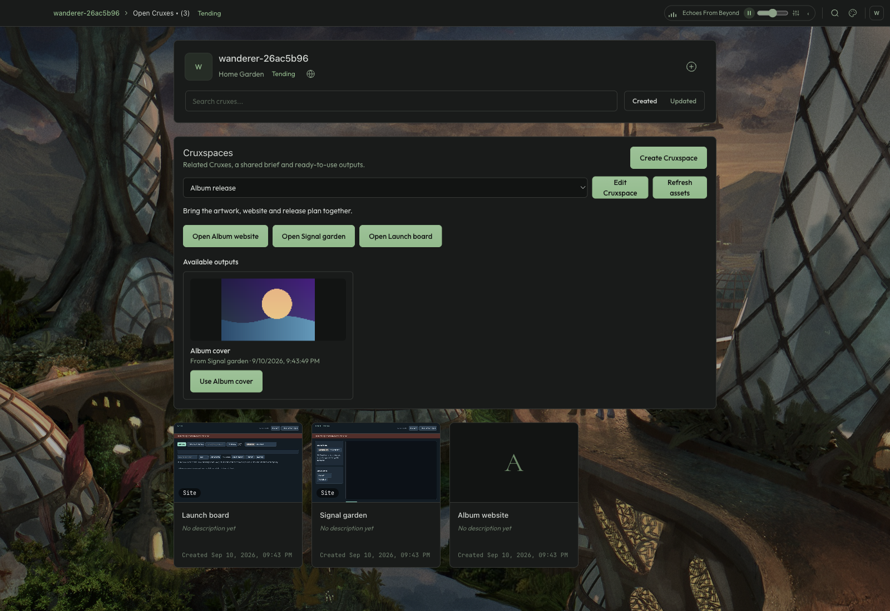
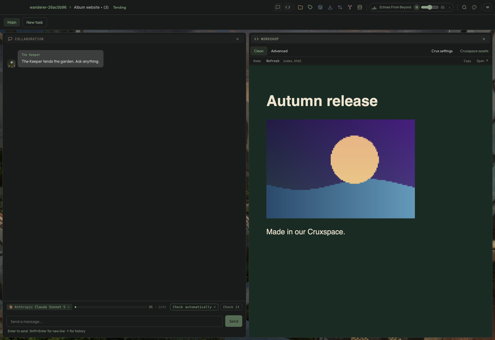

# Cruxspaces: a connected creative workflow

A Cruxspace collects independent Cruxes around a shared brief. Create one in Home Garden, select its members, then open any member from the hub. Closing a workspace or removing collection membership keeps the Crux and its history intact.

In a newly created OpenMosh effects Crux, choose **Save output for Cruxspace**. Its rendered image appears in the collection’s outputs. Choose **Use** from Home Garden, or **Cruxspace assets** in a receiving Workshop, and select a new destination image path. For Astro, use `public/assets/cover.png` and reference `/assets/cover.png` on the page. A transfer saves the selected bytes and their origin; it does not insert markup or follow future source edits.

Agents can call `list_cruxspace_assets` to discover their Crux’s collections, briefs and outputs, then `use_cruxspace_asset` to copy a specific fingerprint. Both the image and its origin sidecar must fit a Task’s write scope. Unrelated collections are inaccessible through these tools.

## Persistence and boundaries

Collection membership and briefs live in local SQLite settings and are included in whole-Garden backups. Explicit output images and descriptors are ordinary source Artifacts; receiving images and `cruxspace-assets/` origin records are ordinary destination Artifacts. Growth and complete Crux archives retain them. Website publication excludes the private descriptors and origin records while retaining images. Git is not required.

The initial output contract supports PNG, JPEG, WebP and GIF up to 4 MB. Only explicit outputs in member Main copies are discoverable; unmerged Tasks are not advertised. Transfers reject stale selections and existing destination paths. Complete `.cruxspace` export/import, automatic updates, scheduled pipelines and arbitrary media outputs remain future work. Existing OpenMosh Cruxes retain their original app source; the new export control is in newly created copies.

## Verification

`electron/e2e/cruxspace.spec.ts` drives an isolated real Electron Garden: create a website, render OpenMosh artwork, edit a Tables tracker, collect all three, copy the image through Workshop, display it in the website, discover and copy it through a scripted Collaboration turn, revise source artwork, remove membership and restart. It verifies actual destination bytes and origin records. The scripted provider exercises integration; it does not measure live-model tool choice.

Service tests exercise membership, discovery boundaries, exact-byte transfers, Task write scopes, overwritten/stale-path refusal, Growth restore and complete Crux archive import/export. Publication and embedded preview tests ensure internal origin records stay private and saving output does not restart the editor.

Screenshots from the real desktop journey:

