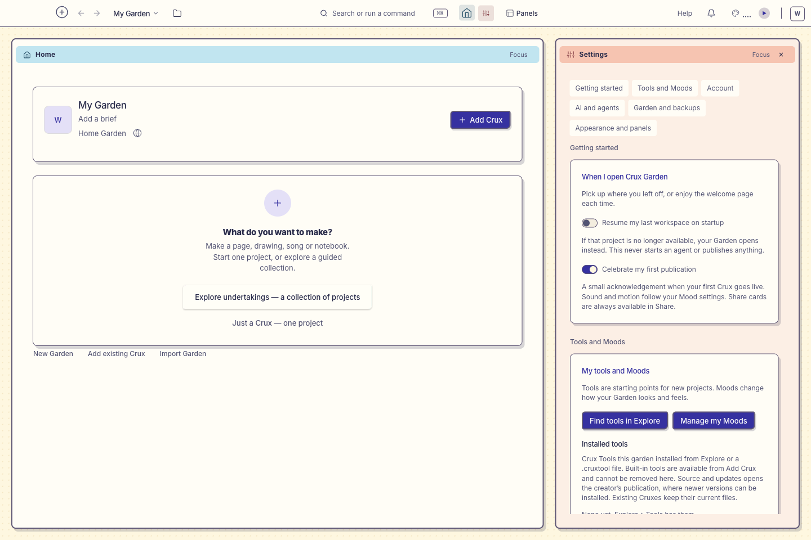
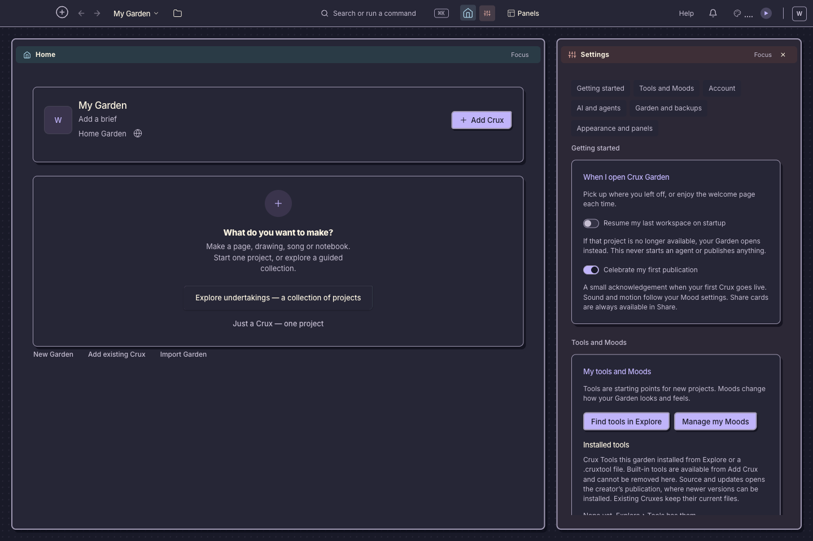
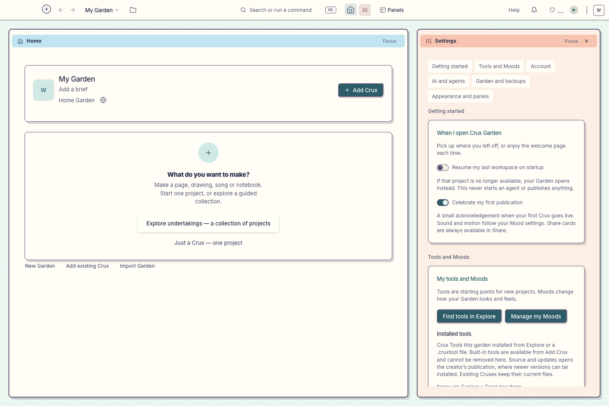
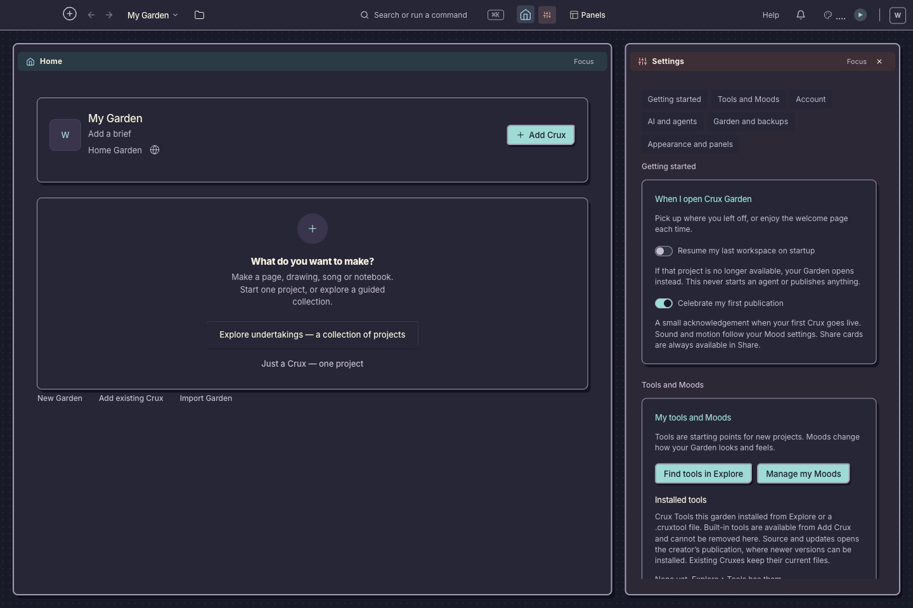
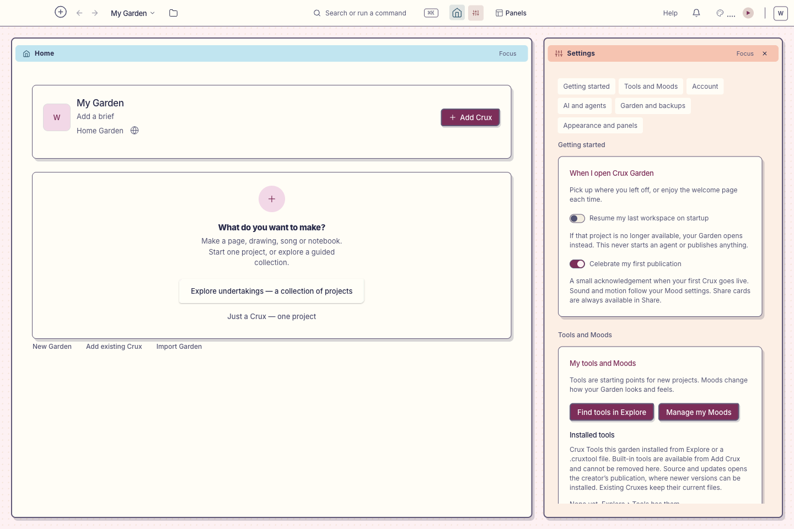
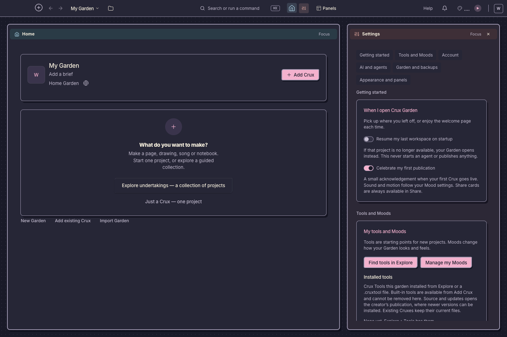

# Paper variations

Actual desktop screenshots of all six bundled Paper Moods, captured without AI
in an isolated test Garden. The same Home and Settings layout is used throughout.
Select **Mood → Paper → Hue → Light/Dark** to wear one.

| Hue       | Light                                   | Dark                                  |
| --------- | --------------------------------------- | ------------------------------------- |
| Sunflower |  |  |
| Lagoon    |        |        |
| Berry     |          |          |

The variations share the cut-paper borders, pane colors and offset shadows.
Hue changes the background pattern and accents; the dark variants share their
foundation palette. These are screenshots of existing Moods, not new designs.

Reproduce from `app/electron` with Node 24 after building the app:

```sh
CRUX_SHOTS=1 npm run test:e2e -- e2e/paper-variations.spec.ts --project=desktop
```

Accepted capture and geometry checks: `/tmp/task-read-desktop-accepted.log`.
Each screenshot waits for Settings content and the selected hue, clears hover/focus
from the Mood flyout, and disables animations for the capture. All six inspected.

The shared switch thumb now centers vertically and leaves equal outer insets at
either active end. The regression checks both states in all six Moods, pressed
stretch, custom 38×20 dimensions, and saved dimensions after actual restart.
See `evidence.json` for acceptance and accessibility limits.
