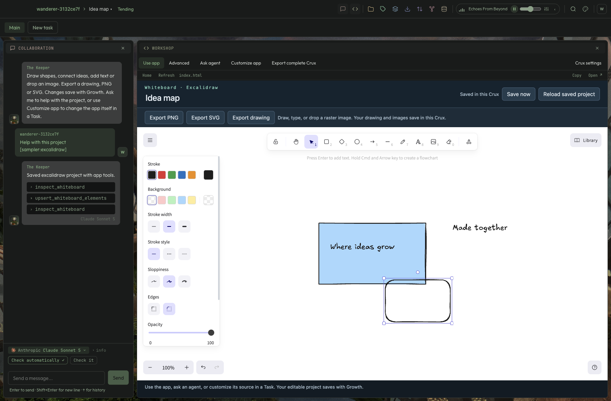
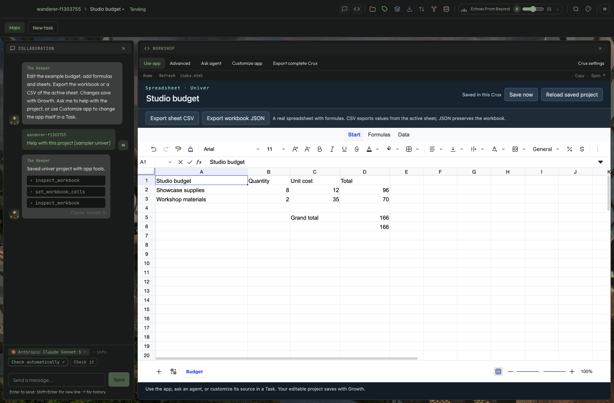

# Whiteboard and Spreadsheet in Workshop

Implemented on `codex/whiteboard-spreadsheet-tools`, 2026-09-10.

Create **Whiteboard** or **Spreadsheet** from Add Crux in Desktop Mode. These are the actual Excalidraw and Univer editors, with confirmed Garden saves and native editable documents. Existing Cruxes retain their own app sources; this adds new templates rather than upgrading customized projects automatically.

- Whiteboard supports native drawing, PNG/SVG/editable drawing exports, and scoped `inspect_whiteboard` / `upsert_whiteboard_elements` agent operations. Raster image bytes are separate content-addressed Artifacts.
- Spreadsheet supports native cells, formulas, formatting and sheets, CSV/workbook JSON export, and scoped `inspect_workbook` / `set_workbook_cells` operations. Input edits recompute dependent formulas before a successful agent result is returned.
- Both keep drafts after conflicts, explicitly reload saved projects, and preserve documents through Growth and complete private Crux archives. Exporting a result is separate from website sharing, which is unavailable for these local tools.

## Evidence

The screenshots show real isolated Electron Workshop sessions after manual and scripted-agent edits. They are not visual mockups. The scripted provider exercises the real Collaboration executor and app bridge; it does not evaluate a live model's reasoning.

The spreadsheet journey manually changes A2 to “Showcase supplies”, asks the agent to change B2 from 4 to 8 and add a SUM formula, then verifies D2 is 96 and the total is 166. It checks those values in both the saved workbook and downloaded CSV. The Whiteboard journey draws a shape with pointer input, then adds/updates shapes through the agent while preserving that manual drawing. Both test downloaded native files, retained drafts after an external write conflict, explicit reload, and complete app restart.

`electron/e2e/productivity-tools.spec.ts` is included in `npm run test:e2e:apps`. The broader 27-journey desktop suite passed, followed by all nine affected desktop journeys after the final capture and test-teardown fixes. App and Electron verify gates passed; the app service suite has 91 files / 887 tests. The sampler now has 12 model/session tests, including edits during asynchronous capture, failed capture retry, discard/reload of an uncaptured buffer, and inspection preserving autosave. Service tests cover write scope, current-view ownership, Growth restore, archive round trips and separate image bytes.

Review caught and fixed initial Excalidraw hydration overwriting the starter with an empty scene, relative font URLs rewritten for the wrong server, stale cached spreadsheet formulas after agent edits, and native capture/reload/autosave races. Final regression results are recorded in the root BUILD-LOG.

## Deliberate v1 limits

Whiteboard: 2,000 elements, 40 raster images, each up to 4 MB and 16 megapixels. Agent operations cover five basic shape types; the manual native editor offers more. Embedded websites and persistent native undo stacks are not included.

Spreadsheet: 20 sheets, 10,000 rows and 256 columns per sheet, 20,000 populated cells total. The project envelope has a 2-million-character JSON bound. No XLSX import/export, Univer Pro backend, live multi-user coediting, or full Office compatibility claim. The editor state is captured at meaningful save boundaries rather than cloning a whole workbook on each pointer event.

Runtime bundles are approximately 22 MB (Whiteboard including fonts) and 11 MB (Spreadsheet), stored as ordinary Artifacts. Unchanged runtime/media fingerprints can be reused by the Blob Store across Growth snapshots. These sizes do not represent per-edit additions; edited document JSON gets a new blob. Large media can still grow storage, and these limits are not a large-workbook performance benchmark.

## Dependencies and notices

Excalidraw 0.18.1, Univer core Sheets 0.25.1 and React 19.2.4 are pinned in `tool-cruxes/package-lock.json`. Local bundles carry generated package/font notices and SHA-256 provenance. The legacy Excalidraw Liberation 1.05 fallback is replaced with OFL-licensed Liberation Sans 2.1.5; its upstream archive hash and WOFF2 conversion are recorded in `tool-cruxes/license-supplements/`. The build fails if a contributing package lacks a license text.

The tool package audit reported zero vulnerabilities after pinned lodash-es/nanoid overrides. The overall verify log still includes the pre-existing moderate audit warning in the separate Moqira package; this work does not change that dependency set. Public Cardinal distribution and other previously tracked release reviews remain separate.
