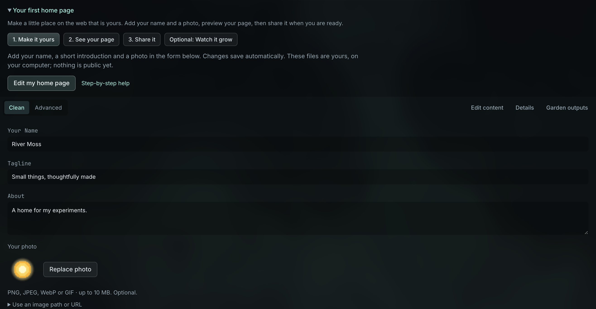
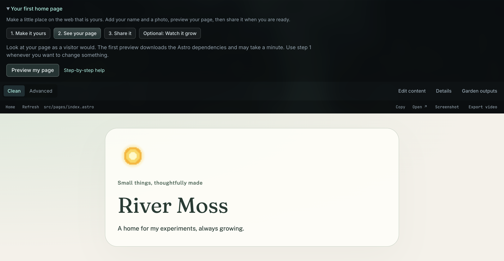
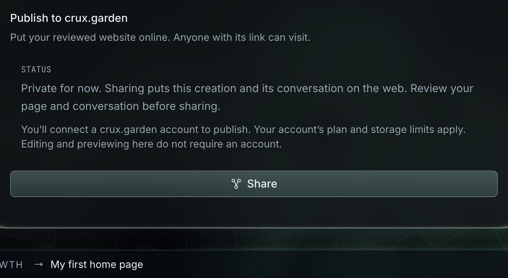

## Start with Hello, world

When you plant a new Garden, choose **A home page or website**. Leave Advanced Mode off for a simpler workspace. Keep the suggested first project and choose **Create & open** to open **Hello, world** directly. The guide stays inside your workspace; it will not appear on your published site.

Already have a Garden? Choose **Add Crux → Hello, world → Create** for the same walkthrough. **Astro Home Page** is a larger starter with a blog and works collection when you want more.

## Make it yours

The editing form opens for you in normal mode. You can also choose **Edit my home page** in the walkthrough. In the form, change **Your Name**, **Tagline**, and **About**. Upload a PNG, JPEG, WebP, or GIF photo up to 10 MB. Choose a photo you’re comfortable making public if you plan to publish.

**1 · Personalize.** Choose **Next: preview my page** when your name and photo look right. You do not need Advanced or any source files.

The files are saved locally as you work. Changing your photo creates a new file; your earlier image is not silently replaced.

## See your page

Choose **Next: preview my page** in the walkthrough. The first preview prepares the tools your page needs and requires the internet. Once it is ready, changes update the local preview. The welcome starter publishes just this one page—there are no example posts or hidden sample pages to clean up.

**2 · Check the result.** You should see your own name, introduction and photo. Open **All steps and more help → 1. Make it yours → Edit my home page** to change them.

If the preview fails, read the build message before trying again. You can keep editing your content while you resolve it.

## Give it an address on crux.garden

Choose **Next: publish my page** to open Share. Review what will be public, choose **Share**, and sign in if asked. Publishing builds your site and uploads the result. Your account’s plan and storage limits apply. Guestbooks and API functions are under **Optional enhancements**; you do not need them for this page. Wait for success, then open the resulting link and check it as a visitor.

**3 · Choose when to go public.** Read the status before pressing **Share**. After it succeeds, **Copy link** gives you the visitor address. Editing locally does not update the public site until you share again.

Want a rehearsal? In Share, expand **Local test website (optional) → Test locally first** and choose **Publish to local test Garden**. This saves a separate visitor-facing website copy on this computer. It does not change the live website. See [local testing and its limits](../../guides/sharing/#test-locally-first-optional).

No AI is required for any of these steps. Read [Preview and Share](../../guides/sharing/) before publishing private material.

## Optional: keep a named version

Your edits already save automatically. When you want to mark a milestone, open **Growth**, choose **Mark version**, and name it “My first home page”. This is optional; you can publish first. See [Growth](../../guides/growth/).
